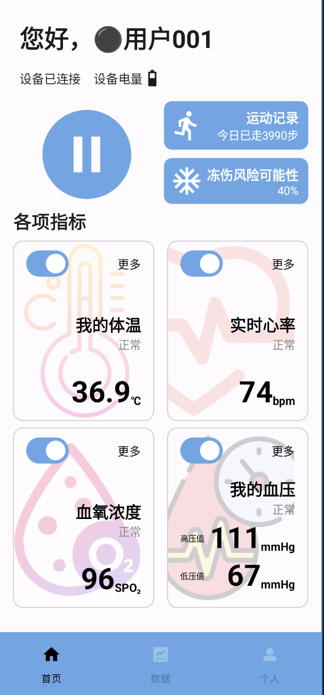
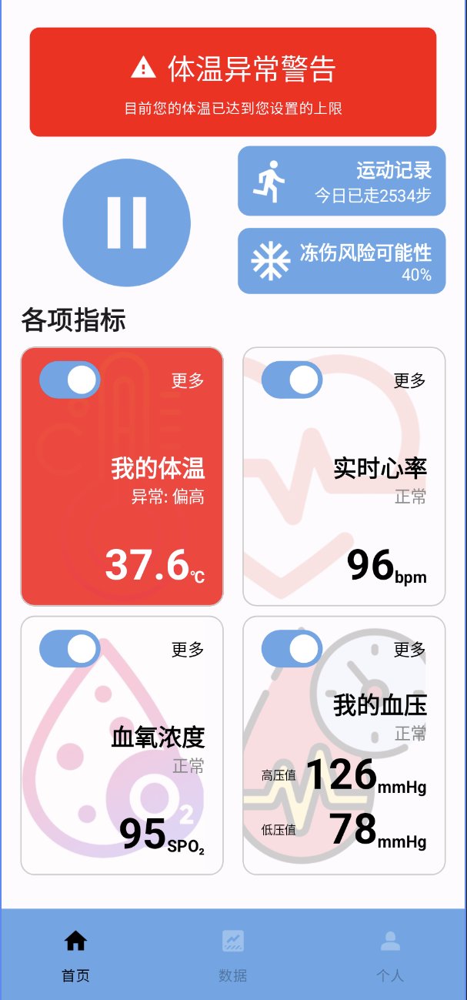
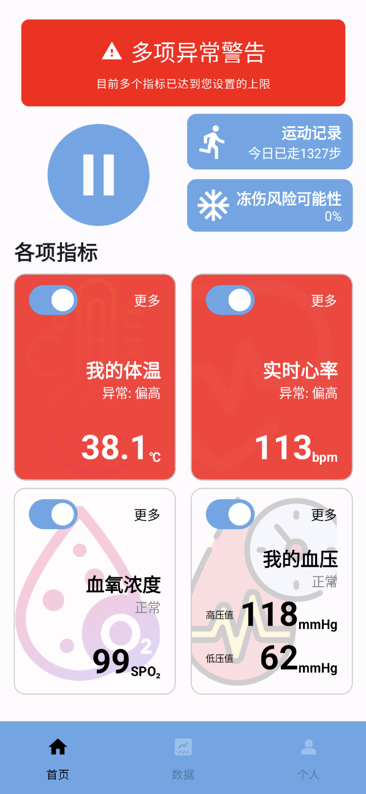

# simpleHealthManagement

## 项目架构

#### 文件介绍

本项目主要包含三个核心部分：MainActivity 作为应用的入口点，负责初始化用户界面和 HealthViewModel；

HealthViewModel 负责管理应用的数据和业务逻辑，包括健康指标的状态维护、随机数据生成以及状态判断；

HealthScreen 则作为用户界面，使用 Jetpack Compose 构建，通过观察 ViewModel 中的数据状态来动态更新 UI。

#### MVVM架构分析

该项目遵循 MVVM (Model-View-ViewModel) 架构，其中 HealthViewModel 作为 ViewModel，负责数据的准备和业务逻辑，并通过 StateFlow 将数据暴露给 View；

HealthScreen 作为 View，是被动的 UI 组件，仅负责展示 ViewModel 提供的数据并响应用户操作；

而 Model 的概念则体现在 ViewModel 中持有的数据状态。

## 开发环境配置

1. 创建Github仓库并本地创建EmptyViewActivity于相应的文件夹。
2. 使用AI工具创建一个应用基本的框架，将对应部分复制粘贴到对应的文件里。
3. 尝试运行，并对缺少的依赖库或者代码的bug进行修改。
4. 根据Android Studio反馈错误，利用AI工具快速清楚开发时环境配置的障碍，直到可以正确运行app无报错并在虚拟机中看到窗口。
5. 正式开始开发。
6. 开发过程中需要的调用其他包酌情添加，开发结束后整理gradle设置。

#### 使用的依赖库以及对应版本

AndroidX 核心库:

    androidx.core:core-ktx: 1.15.0
    androidx.appcompat:appcompat: 1.7.0
    androidx.activity:activity: 1.10.1
    androidx.activity:activity-compose: 1.7.2
    androidx.constraintlayout:constraintlayout: 2.2.1

AndroidX Lifecycle 库:

    androidx.lifecycle:lifecycle-runtime-ktx: 2.6.2
    androidx.lifecycle:lifecycle-viewmodel-compose: 2.6.2
    androidx.lifecycle:lifecycle-runtime-compose: 2.6.2

AndroidX Compose 库:

    androidx.compose.ui:ui: 1.5.3
    androidx.compose.ui:ui-tooling: 1.5.3
    androidx.compose.ui:ui-tooling-preview: 1.5.3
    androidx.compose.material3:material3: 1.2.0
    androidx.compose.material:material-icons-extended: 1.5.3

Material Design 库:

    com.google.android.material:material: 1.12.0

测试库:

    junit:junit: 4.13.2
    androidx.test.ext:junit: 1.2.1
    androidx.test.espresso:espresso-core: 3.6.1

Gradle 插件:

    com.android.application: 8.6.0
    org.jetbrains.kotlin.android: 1.9.10

## 编译和运行方法

应用Android Studio中模拟机进行运行。开发完成后，创建apk安装包在手机上尝试运行。

## 自动化测试运行

本次开发中未使用到测试工具。

## 程序运行截图

  
  
  

